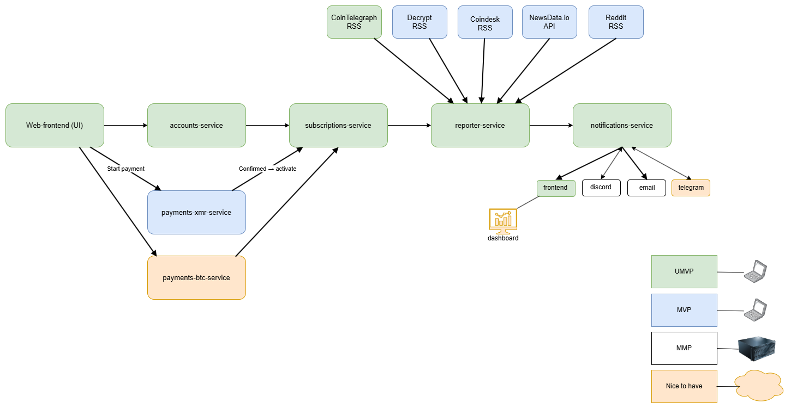

# Nova Report

**Nova Report** is a microservice-based platform that generates **AI-driven crypto reports every 4 hours**.  
It collects information from multiple sources — such as market data APIs and news feeds — and summarizes the most relevant events into a clear, neutral daily report.

---

## 🧩 Overview

Nova Report is designed as a modular system with seven main services:

| Service | Responsibility |
|----------|----------------|
| **accounts-service** | User registration, login, and authentication |
| **subscriptions-service** | Tracks subscription status and access control |
| **payments-xmr-service** | Handles Monero payments and activates subscriptions |
| **payments-stripe-service** | Handles Stripe card payments and subscription activation |
| **reporter-service** | Fetches external data, creates and stores the daily report |
| **notifications-service** | Sends daily reports via email and Discord |
| **web-frontend** | User-facing interface for registration, subscription, and report reading |

---

---

## 🚀 Features

- AI-generated crypto reports every 4 hours (6 reports per day)  
- Secure login and account management  
- Subscription system with Monero and Stripe payments  
- Email and Discord delivery options  
- Modular architecture built as microservices  
- Extensible design for future integrations (Telegram, BTC, etc.)

---

## 💎 Premium Access

- Monthly or yearly plans via Stripe or Monero with instant activation once the payment clears.  
- Full access to the latest report feed plus the email/Discord digests once a subscription is active.  
- Automated payment confirmations through Stripe webhooks and the Monero payment monitor so users don’t have to wait for manual approval.  
- Access checks enforced before reports are served to ensure premium-only content stays protected.

---

## 🧠 Technology Stack

- **Backend:** Spring Boot (Java 21)  
- **Frontend:** React + TypeScript  
- **Database:** PostgreSQL (H2 for development)  
- **Containerization:** Docker / Docker Compose  
- **AI integration:** 1min.ai (e.g. gpt-4o-mini) via `OneMinAiSummarizerService`  
- **Deployment:** Nginx Proxy Manager + Portainer

---

## 🗂️ Project Goals

The goal of Nova Report is to demonstrate:
- Scalable microservice communication  
- Secure payment integration using Monero and Stripe  
- Real-world data ingestion from public APIs  
- Automated content generation with AI  
- Clear separation of responsibilities between services

---

## � Example Flow

1. A visitor signs up and logs in through the web frontend.  
2. The user purchases a subscription with Stripe or Monero.  
3. Payment confirmation (Stripe webhook or Monero monitor) activates the subscription in subscriptions-service.  
4. Every 4 hours the reporter-service ingests crypto news and builds the latest report with 1min.ai.  
5. notifications-service delivers the report by email/Discord and exposes it to the frontend.  
6. The user reads the latest report in the browser once access is granted.

---

## ⚠️ Disclaimer

Nova Report does **not** provide financial advice.  
All reports are AI-generated summaries for informational purposes only.

---

## 📄 License

This project is developed as part of a **Java Integration Engineering thesis project (Campus Mölndal)**.  
License: MIT (for educational use).
