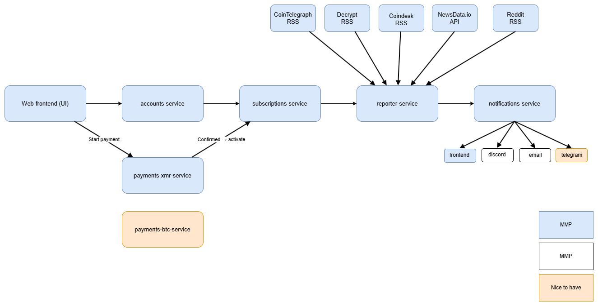

# Nova Report

**Nova Report** is a microservice-based platform that generates **daily AI-driven crypto reports**.  
It collects information from multiple sources — such as market data APIs and news feeds — and summarizes the most relevant events into a clear, neutral daily report.

---

## 🧩 Overview

Nova Report is designed as a modular system with six main services:

| Service | Responsibility |
|----------|----------------|
| **accounts-service** | User registration, login, and authentication |
| **subscriptions-service** | Handles subscription status and access control |
| **payments-xmr-service** | Manages Monero payments and activates subscriptions |
| **reporter-service** | Fetches external data, creates and stores the daily report |
| **notifications-service** | Sends daily reports via email and Discord |
| **web-frontend (UI)** | Interface for registration, subscription, and viewing reports |

---

---

## 🚀 Features

- AI-generated daily crypto reports  
- Secure login and account management  
- Subscription system with Monero payments  
- Email and Discord delivery options  
- Modular architecture built as microservices  
- Extensible design for future integrations (Telegram, BTC, etc.)

---

## 🧠 Technology Stack

- **Backend:** Spring Boot (Java 21)  
- **Frontend:** React + TypeScript  
- **Database:** PostgreSQL (H2 for development)  
- **Containerization:** Docker / Docker Compose  
- **AI integration:** T.B.D.  
- **Deployment:** Nginx Proxy Manager + Portainer

---

## 🗂️ Project Goals

The goal of Nova Report is to demonstrate:
- Scalable microservice communication  
- Secure payment integration using Monero  
- Real-world data ingestion from public APIs  
- Automated content generation with AI  
- Clear separation of responsibilities between services

---

## 📅 Example Flow

1. User registers and logs in  
2. User subscribes and pays with Monero  
3. Payment confirmation activates the subscription  
4. Reporter service gathers daily crypto data  
5. AI generates the daily report  
6. Notifications service sends it via email or Discord  

---

## ⚠️ Disclaimer

Nova Report does **not** provide financial advice.  
All reports are AI-generated summaries for informational purposes only.

---

## 📄 License

This project is developed as part of a **Java Integration Engineering thesis project (Campus Mölndal)**.  
License: MIT (for educational use).
