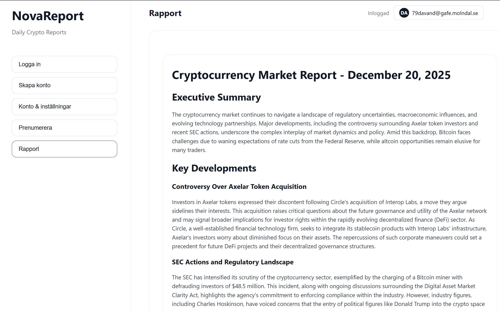
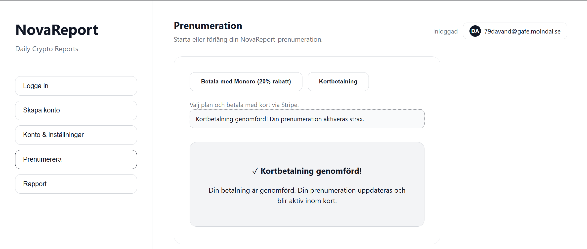
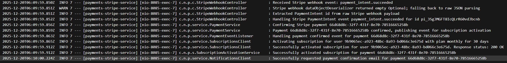
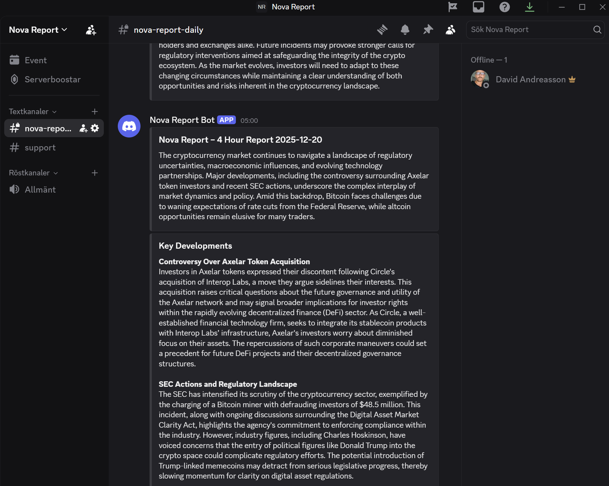
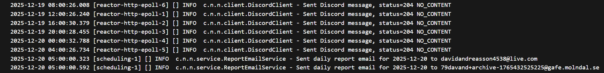

# Nova Report — Rapportutkast (IMRAD)

## Sammanfattning

I detta examensarbete har en prototyp utvecklats för att automatiskt samla in kryptorelaterade nyheter, bearbeta dem och presentera en återkommande rapport till användare. Lösningen, Nova Report, är uppbyggd som en microservice‑baserad integrationsplattform med separata tjänster för konto/inloggning, prenumerationsstatus, betalningar, rapportgenerering och notifieringar.

Plattformen hämtar nyheter från konfigurerade RSS‑källor, deduplicerar innehåll och genererar en rapport schemalagt var fjärde timme. Rapporterna görs tillgängliga i en React‑baserad webbklient för inloggade användare, medan premiumfunktioner (som e‑postutskick och Discord‑kanal) styrs av prenumerationsstatus.

Prenumeration aktiveras via ett betalningsflöde som kan genomföras med Monero eller Stripe. För Monero skapas en unik subadress och betalningen bekräftas genom övervakning av inkommande betalningar. Funktionalitet har verifierats genom manuella end‑to‑end‑scenarion (konto/inloggning, betalning/aktivering samt rapport/distribution), där loggar och UI‑/kanalutskick används som evidens.

## Innehåll

- [Introduktion](#introduktion)
  - [Bakgrund och syfte](#bakgrund-och-syfte)
  - [Problemformulering och avgränsningar](#problemformulering-och-avgränsningar)
  - [Mål med projektet](#mål-med-projektet)
- [Metod](#metod)
  - [Teorier, best practices och koncept](#teorier-best-practices-och-koncept)
  - [Hur arbetet genomfördes](#hur-arbetet-genomfördes)
  - [Designprinciper som tillämpas](#designprinciper-som-tillämpas)
  - [Planering och tidsplan](#planering-och-tidsplan)
- [Resultat](#resultat)
  - [Systemöversikt (implementerad lösning)](#systemöversikt-implementerad-lösning)
  - [Valda flöden (2–3 st)](#valda-flöden-2–3-st)
    - [Flöde 1: Konto och åtkomst (registrering → inloggning → läsa rapport)](#flöde-1-konto-och-åtkomst-registrering--inloggning--läsa-rapport)
    - [Flöde 2: Prenumeration och betalning (betalning → verifiering → aktivering)](#flöde-2-prenumeration-och-betalning-betalning--verifiering--aktivering)
    - [Flöde 3: Rapport och distribution (rapportgenerering → notifiering)](#flöde-3-rapport-och-distribution-rapportgenerering--notifiering)
  - [Verifiering och evidens](#verifiering-och-evidens)
  - [Koppling till kursens lärandemål (G/VG-checklista)](#koppling-till-kursens-lärandemål-gvg-checklista)
- [Diskussion](#diskussion)
- [Slutsats](#slutsats)
- [Referenser](#referenser)
  - [Referenser (i inlämnat repo)](#referenser-i-inlämnat-repo)
  - [Externa källor](#externa-källor)
- [Bilagor](#bilagor)

---

# Introduktion

## Bakgrund och syfte

Kryptomarknaden är en av de mest snabbföränderliga och informationsintensiva
branscherna i världen. Nyheter, tweets och officiella uttalanden kan på bara några timmar
påverka värdet på digitala valutor. Informationen sprids genom ett stort antal
nyhetsplattformar, sociala medier och andra flöden, vilket gör det svårt för användare att få
en samlad och objektiv överblick.

Syftet med detta projekt är att undersöka hur modern systemintegration och AI kan
användas tillsammans för att automatiskt samla, bearbeta och sammanfatta information från
flera källor. Resultatet ska bli en tjänst som presenterar en daglig rapport över de viktigaste
händelserna inom kryptovärlden, på ett sätt som är neutralt, automatiserat och lättillgängligt.

## Problemformulering och avgränsningar

Informationsflödet kring kryptovalutor är enormt och präglas ofta av starka åsikter, politiska
intressen och ekonomiska motiv. Många nyhetskällor och sociala plattformar blandar fakta
med tolkningar, spekulationer eller marknadsföring, vilket gör det svårt att skilja objektiv
information från subjektiv påverkan.

Även om det finns flera tjänster som samlar kryptonyheter, fokuserar de flesta på
kursrörelser, sentimentanalys eller marknadspåverkan, snarare än att neutralt återge vad
som faktiskt har hänt. Det saknas en lösning som automatiskt kan sammanställa
nyhetsflöden från flera källor, filtrera bort värdeladdade formuleringar och presentera
händelser i ett så opartiskt format som möjligt.

Nova Report utvecklas därför som en teknisk prototyp som visar hur AI och
systemintegration kan användas för att skapa en automatiserad, neutral nyhetsrapport.
Syftet är inte att tolka, värdera eller ge finansiella råd, utan att erbjuda en daglig
sammanställning av faktiska händelser och beslut inom kryptovärlden, en neutral
mellanhand mellan användaren och informationsbruset.

Avgränsningar i detta examensarbete:

- Systemet fokuserar på ett urval av nyhetskällor via RSS (konfigurerade feeds). Sociala medier ingår inte som egna integrationer (t.ex. Twitter/X‑API), men RSS‑feeds kan i praktiken peka på innehåll som publicerats på plattformar som Reddit.
- Rapporten är en automatisk sammanställning och är inte finansiell rådgivning. Den är avsedd som en neutral överblick, inte som investeringsunderlag.
- Rapportgenerering sker schemalagt och är optimerad för en tydlig demo. I den implementerade lösningen genereras rapporter var fjärde timme.
- Åtkomst till rapporten i webbgränssnittet kräver inloggning, men inte aktiv prenumeration. Prenumeration används i stället för premiumfunktioner (t.ex. e‑postutskick och Discord‑åtkomst).
- Betalning stöds via Monero och Stripe. Andra betalmetoder och valutor är utanför scope.
- Projektet är framtaget för min egen examination och demonstration. Rapporten och repo:t är inte avsedda som en publik drift-/installationsprodukt för externa användare.

## Mål med projektet

Målet är att utveckla en fungerande lösning bestående av flera mikrotjänster som
tillsammans kan:

- Samla in nyheter och data från externa API:er och RSS-flöden.
- Låta en AI-tjänst sammanfatta och skapa en daglig kryptorapport.
- Låta användare registrera sig, logga in och läsa rapporten på webben.
- Låta användare betala för sitt medlemskap via kryptovaluta
- Möjliggöra distribution av rapporten via e-post och Discord/Slack/Telegram eller liknande
plattformar.

Projektet syftar också till att visa hur man kan bygga en modulär integrationsplattform med
tydlig ansvarsfördelning mellan tjänster, samt hur AI kan användas som en del av en
integrationslösning för att skapa värde av ostrukturerad data.

Konkreta krav i projektet:

Måste‑krav:

- Användaren ska kunna registrera sig och logga in i webbklienten (JWT‑baserad inloggning).
- Systemet ska kunna hämta in nyheter från konfigurerade RSS‑källor och generera en återkommande rapport.
- Den senaste rapporten ska kunna läsas av inloggade användare i webbgränssnittet.
- Systemet ska kunna initiera och verifiera betalning via både Monero och Stripe.
- En bekräftad betalning ska aktivera en prenumeration som kan användas för åtkomstkontroll i premiumfunktioner.

Bör‑krav:

- Systemet bör kunna distribuera rapporten i minst en premiumkanal (t.ex. e‑post och/eller Discord) för användare med aktiv prenumeration.
- Systemet bör ha tydliga integrationsgränssnitt och intern autentisering för service‑till‑service‑anrop.
- Systemet bör ha grundläggande driftstöd (t.ex. health endpoints) och loggning som underlättar felsökning vid demo.
- Systemet bör ha dokumentation i repo:t som gör det möjligt att följa arkitektur och flöden (t.ex. serviceöversikt och scheduler‑beskrivning).

---

# Metod

## Teorier, best practices och koncept

Arbetet med Nova Report utgår från ett antal etablerade teorier och best practices inom modern
systemutveckling.

En grundläggande utgångspunkt är microservice‑arkitektur. I stället för en monolit är systemet
uppdelat i flera mindre tjänster med tydligt avgränsade ansvarsområden. Varje tjänst har ett eget
domänfokus, exempelvis konton, prenumerationer, betalningar, rapportgenerering och
notifieringar. Detta följer principerna om separation of concerns och high cohesion/low coupling.
Det gör det lättare att utveckla och testa varje del för sig, och att skala eller byta ut komponenter
vid behov.

Kommunikationen mellan tjänsterna bygger huvudsakligen på REST‑baserade API:er. Det
innebär att man använder HTTP‑verb, resurser och statuskoder på ett konsekvent sätt, vilket är
en beprövad standard i distribuerade system. I backend följer koden en typisk lagerindelning
med controller‑lager, service‑lager och data‑/repository‑lager. Det ger en tydlig separation mellan
presentation av API:et, affärslogik och datalagring, och underlättar testning och vidareutveckling.

Projektet använder också inslag av event‑driven design. När en betalning blir bekräftad i
betalningstjänsten publiceras en intern händelse som i sin tur triggar aktivering av användarens
abonnemang i prenumerationstjänsten. På så sätt kopplas betalningslogiken lösare från
abonnemangslogiken, vilket stämmer med principer om asynkron kommunikation och eventual
consistency.

När det gäller säkerhet utgår arbetet från best practices som autentisering med JWT, separata
interna API‑nycklar för kommunikation mellan tjänster samt försiktighet kring externa anrop, till
exempel skydd mot SSRF genom validering av konfigurerade bas‑URL:er. Dessutom används
loggsanitering för att undvika att känsliga uppgifter skrivs ut i loggar.

Slutligen vilar projektet på principer hämtade från DevOps och 12‑factor app. Tjänsterna körs i
Docker‑containrar, konfiguration sker via environment‑variabler och Docker Compose används
för att starta hela systemet. Det gör miljön reproducerbar och förenklar både lokal utveckling och
senare drift.

## Hur arbetet genomfördes

Arbetet planeras att genomföras iterativt och inkrementellt. I stället för att försöka bygga allt på
en gång delas projektet upp i mindre delmål där varje steg ger ett fungerande delresultat.

Ett första steg är att säkerställa ett minsta fungerande flöde genom systemet: registrering av
användare, mockat skapande av abonnemang, mockad betalning med Monero och generering
av en enkel rapport. Detta ger en baslinje som sedan kan förbättras och utökas. Varje iteration
fokuserar på en tydlig del, till exempel betalningsflödet eller schemalagd rapportgenerering, och
avslutas med testning.

Som en del av arbetssättet har jag löpande gjort strukturerade arkitektur‑ och
kodgranskningar utifrån en gemensam audit‑mall. Varje granskning har resulterat i en
tvåspråkig rapport med sammanfattning, betyg per område och en konkret åtgärdslista. Dessa
rapporter används som underlag för nästa iteration: jag väljer ut ett fåtal prioriterade åtgärder
från checklistan och implementerar dem innan nästa audit görs. På så sätt får projektet en
återkommande "hälsokontroll" där arkitektur, säkerhet och kodkvalitet följs upp systematiskt.

Genom hela arbetet är målet att hålla förändringar små och väl avgränsade, dokumentera viktiga
beslut i projektets dokumentation och löpande refaktorera kod som blir svåröverskådlig. På så
sätt blir projektet stegvis mer robust utan att man tappar kontrollen över helheten. I samband
med lite större ändringar arbetar jag via pull requests på GitHub, där jag använder GitHub
Copilots PR‑granskning som stöd. Copilot analyserar ändringarna, pekar ut möjliga problem och
föreslår förbättringar på samma sätt som en senior utvecklare skulle göra vid en kodgranskning.
Det ger snabb feedback på design‑ och kodbeslut och hjälper till att upptäcka brister tidigt i
processen.

Versionhantering sker i Git, vilket möjliggör arbete i separata brancher för nya funktioner. När en
funktion är tillräckligt stabil kan den integreras tillbaka till huvudgrenen. Det ger spårbarhet och
minskar risken för konflikter.

Databasschema och förändringar hanteras med versionsstyrda databasmigrationer via Flyway. Varje tjänst har en mapp för migrationer (t.ex. `src/main/resources/db/migration`), vilket gör att databasändringar blir spårbara och kan köras automatiskt vid uppstart.

Testning sker på flera nivåer. På kodnivå är målet att använda enhetstester och enklare
integrationstester för kritiska delar, som betalningslogik och abonnemangsaktivering. På
systemnivå användes Docker Compose främst i tidiga iterationer (UMVP/MVP) för att starta hela
plattformen lokalt och utföra manuella end‑to‑end‑tester: skapa användare, göra betalningar,
kontrollera att rapporter genereras och att notifieringar skickas. I senare iterationer verifierades
ändringar huvudsakligen i en produktionslik “live”-miljö, eftersom den lokala stacken inte
kontinuerligt hölls i synk med all ny funktionalitet och konfiguration. Loggar används aktivt för
felsökning och för att verifiera att schemalagda jobb och event‑drivna flöden fungerar som tänkt.

För att göra kod- och testkontroller mer konsekventa används även ett gemensamt kvalitetsscript (`check-code.ps1`). Scriptet kör bland annat `mvn clean verify` per backend-tjänst (inklusive tester och JaCoCo-coverage med en miniminivå), samt statisk analys med SpotBugs (inklusive FindSecBugs). För frontend körs lint, build och tests med coverage. En sammanfattning skrivs till `code-quality-report.txt`.

## Designprinciper som tillämpas

Flera konkreta designprinciper ligger till grund för lösningen.

En central princip är separation of concerns. Varje microservice ansvarar för ett eget
domänområde, och inom respektive tjänst är koden uppdelad i tydliga lager (controller, service,
repository). Det minskar komplexiteten, gör koden lättare att förstå och förenklar framtida
förändringar.

Projektet strävar efter lös koppling mellan tjänster. I stället för att hårdkoda beroenden används
konfiguration (till exempel bas‑URL:er och API‑nycklar) och tydliga HTTP‑kontrakt. I de delar
som är mer event‑drivna, till exempel när en bekräftad betalning leder till att ett abonnemang
aktiveras, används interna events och asynkron hantering för att undvika att en tjänst blir
beroende av en annan tjänsts interna implementation.

Ytterligare en princip är robusthet och felhantering. Externa anrop skyddas med retry‑logik och
tydliga undantagstyper. Ett schemalagt jobb övervakar obekräftade betalningar och försöker
bekräfta dem när tillräckligt saldo finns. På så sätt kan systemet hantera tillfälliga nätverksfel eller
fördröjningar i betalningskedjan.

Slutligen eftersträvas konfigurerbarhet och miljöoberoende. Beteenden som fake‑läge för
betalningar, intervall för schemalagda jobb och olika URL:er styrs via properties och
environment‑variabler i stället för att vara hårdkodade. Det följer 12‑factor‑tänket och gör att
samma kodbas kan köras både lokalt i utvecklingsmiljö och senare i en mer produktionslik miljö
utan större ändringar.

## Planering och tidsplan

Planeringen utgick från en initial 8‑veckorsplan som beskriver tänkta aktiviteter och milstolpar (se bilaga D). Under genomförandet genomfördes arbetet iterativt och planen användes främst som ett riktmärke för prioriteringar.

I praktiken genomfördes projektet i följande huvudfaser:

- Vecka 1: uppstart, repo‑struktur, arkitekturunderlag samt grund för konto/auth och prenumerationsflöde.
- Vecka 2: första fungerande end‑to‑end‑kedja (UMVP) och initiala integrationer (rapporter/notifications, schemaläggning samt första iterationer av betalning och AI‑stöd).
- Vecka 3: stabilisering och produktionsanpassning (bl.a. reverse proxy/runtime‑config, Postgres + Flyway och förbättrad nätverks-/RSS‑robusthet).
- Vecka 4: funktions- och kvalitetshöjning: Monero wallet‑RPC (adress/balans), premiumdistribution (e‑post/Discord), metrics samt test/coverage‑krav.
- Vecka 5: UX‑förbättringar och utökad funktionalitet (adminvy, Discord‑inviteflöde och Stripe‑betalning).
- Vecka 6–8: slutlig kvalitetshöjning, refaktorering, dokumentation samt driftsrelaterade justeringar (bl.a. Monero mainnet‑anpassningar).

Avvikelser och justeringar:

- Under projektets gång uppstod en oplanerad risk i form av en veckas sjukdom, vilket innebar att nästan inget arbete alls kunde utföras under den perioden. Eftersom arbetet låg före plan vid tillfället kunde tidsplanen anpassas utan att de viktigaste delmålen behövde skjutas fram.
- För att hålla scope under kontroll prioriterades en enda “nice-to-have”-funktion (Stripe-betalning) som också hann implementeras, medan andra planerade tillägg (t.ex. Telegram) sköts på framtiden.

Som stöd för planering och uppföljning fördes även en enkel arbetslogg i portfolio-format (i stället
för exempelvis Trello/Kanban), vilket ger spårbarhet i hur arbetet fortskred över tid.

---

# Resultat

Målet med detta kapitel är att på ett kompakt sätt beskriva vad som implementerats och visa att lösningen fungerar genom ett fåtal tydliga, verifierade scenarion.

## Systemöversikt (implementerad lösning)

Nova Report är implementerat som en uppsättning microservices som tillsammans samlar in kryptorelaterade nyheter, genererar en rapport och distribuerar den till användare. Varje tjänst har ett avgränsat ansvar (konto/auth, prenumerationsstatus, betalningar, rapportgenerering och notifieringar), vilket gör systemet lättare att vidareutveckla och testa i separata delar.

De centrala delarna i implementationen är:

- accounts-service: registrering/inloggning och utgivning av JWT-access tokens (se `docs/service-overviews.md`).
- subscriptions-service: håller reda på aktiva prenumerationer och exponerar åtkomstkontroll (bl.a. `GET /api/v1/subscriptions/me/has-access`).
- payments-xmr-service: skapar betalningar och unika Monero-subadresser i real-läge (`payments.fake-mode=false`). Pending-betalningar övervakas av `PaymentMonitorService` (polling) och bekräftas när den bekräftade balansen på subadressen når beloppet.
- payments-stripe-service: skapar Stripe PaymentIntents för valda abonnemangsplaner. När Stripe bekräftar betalning via webhook markeras betalningen som bekräftad och prenumeration aktiveras via intern service‑till‑service‑kommunikation.
- reporter-service: hämtar in nyheter (RSS via `RSS_FEEDS`), deduplicerar och genererar rapporter. Rapportgenerering sker schemalagt var 4:e timme via `ScheduledReportGenerator` (se även `docs/scheduler-implementation.md`). Det finns även en uppstarts-trigger (`StartupReportGenerator`) som används för att bootstrap:a en initial rapport efter omstart/test (i prod är detta påslaget via `REPORTER_STARTUP_GENERATE_REPORT=true`).
- notifications-service: tar emot en “report-ready”-notifiering från `reporter-service` (`/api/v1/internal/notifications/report-ready`), sparar rapporten och exponerar den för webbläsning (`GET /api/v1/notifications/latest`). Premiumdistribution sker via e‑post (dagligt jobb) och Discord. Discord-postning triggas direkt när en ny rapport tas emot, vilket gör att Discord uppdateras var 4:e timme i takt med rapportgenereringen. E‑postjobbet filtrerar mottagare så att endast användare som både är e‑postprenumeranter och har aktiv prenumeration får utskick (det syns i bilderna i verifieringsavsnittet).
- frontend: React-baserat UI som knyter ihop användarflödet (registrering/login, köp av prenumeration, läsa rapport).

Drift- och konfigurationsnotering: repo:t innehåller konfiguration för både en lokal utvecklingsstack och en produktionsstack. I den lokala stacken startas `monero-wallet-rpc` med `--stagenet` (se `deploy/docker-compose.yml`). I produktionsstacken startas `monero-wallet-rpc` utan `--stagenet`-flagga och konfigureras via `MONERO_*`-variabler (se `deploy/docker-compose.prod.yml` och `deploy/.env`).

## Valda flöden (2–3 st)

I stället för att beskriva alla interna flöden i detalj redovisas här tre representativa end-to-end-flöden som tillsammans visar att plattformens kärna fungerar.

### Flöde 1: Konto och åtkomst (registrering → inloggning → läsa rapport)

Användaren registrerar sig och loggar in via `accounts-service` och får en JWT-access token. Frontend använder token för att hämta senaste rapporten via `notifications-service` (t.ex. `GET /api/v1/notifications/latest`, i frontend anropas detta som `/api/notifications/latest`). Detta flöde kräver inloggning men inte aktiv prenumeration.

`subscriptions-service` används parallellt för att visa om användaren har betald access (`GET /api/v1/subscriptions/me/has-access`) och för att låsa upp premiumfunktioner som e‑postutskick och Discord‑invite. Resultatet visas i figur 1 (Verifiering och evidens) där samma inloggade användare ser rapporten i UI:t.

Success-utfall: användaren kan logga in och läsa senaste rapporten i webben.

Felhantering (exempel):

- Felaktiga inloggningsuppgifter eller saknad/ogiltig JWT ger nekad åtkomst.
- Om användaren saknar aktiv prenumeration påverkar det premiumfunktioner (t.ex. e‑postutskick och Discord‑invite), men inte möjligheten att läsa rapporten i webben.

### Flöde 2: Prenumeration och betalning (betalning → verifiering → aktivering)

En inloggad användare kan initiera en betalning via frontend med två alternativ: Monero eller Stripe.

Monero: frontend anropar `payments-xmr-service` (t.ex. `POST /api/v1/payments/create`). I real-läge (`payments.fake-mode=false`) skapar tjänsten en unik Monero-subadress via `MoneroWalletClient` och sparar dess index tillsammans med betalningen (PENDING). `PaymentMonitorService` kör periodiskt (fixed delay, styrt av `payments.monitor-interval-ms`) och kontrollerar bekräftad balans för subadressen. När balansen når `amountXmr` bekräftas betalningen genom `PaymentService.confirmPayment(...)`.

Stripe: frontend anropar `payments-stripe-service` (t.ex. `POST /api/v1/payments-stripe/create-intent`) och får tillbaka ett `clientSecret` för en Stripe PaymentIntent. När användaren genomför betalningen bekräftar Stripe detta via webhook (`/api/v1/payments-stripe/webhook/stripe`), vilket gör att betalningen markeras som bekräftad i tjänsten.

Vid bekräftelse publiceras ett event (`PaymentEventPublisher.PaymentConfirmedEvent`) som hanteras efter commit av `PaymentEventListener`. Eventlyssnaren anropar `SubscriptionActivationService`, som aktiverar prenumeration via `subscriptions-service` (internt endpoint `/api/v1/internal/subscriptions/activate`) med retry för transient fel. När prenumerationen är aktiverad syns det i åtkomstkontrollen.

Not: Flödet kombinerar synkrona REST-anrop (skapa betalning, läsa status via `GET /api/v1/payments/{paymentId}/status`) med asynkron logik (monitor + event efter commit) eftersom blockkedjebekräftelser kan ta tid.

I plattformens användarflöde används den aktiverade prenumerationen för premiumfunktioner, framförallt att få rapport via e‑post samt att kunna begära Discord‑invite.

### Flöde 3: Rapport och distribution (rapportgenerering → notifiering)

`reporter-service` genererar rapporter automatiskt var 4:e timme via `ScheduledReportGenerator` (cron `0 0 0/4 * * *`). Vid varje körning hämtas nyheter från konfigurerade RSS-feeds, dubbletter filtreras bort och en rapport byggs (se `docs/scheduler-implementation.md`). Efter att en rapport byggts skickar `reporter-service` en intern notifiering (“report-ready”) till `notifications-service` via `/api/v1/internal/notifications/report-ready`.

`notifications-service` tar emot “report-ready”, sparar rapporten och postar den direkt till Discord via webhook när Discord är aktiverat (i produktion är detta aktiverat via `NOTIFICATIONS_DISCORD_ENABLED=true`). Detta gör att Discord uppdateras i samma takt som rapporten genereras (var 4:e timme), vilket syns i evidensen (Discord-kanal + loggar). För e‑post används `DailyReportEmailJob` (default kl 06:00 svensk tid – motsvarar 05:00 i serverns UTC-loggar), som hämtar e‑postprenumeranter från `accounts-service`, filtrerar mot aktiva användare från `subscriptions-service` och skickar rapporten via e‑post. Det finns även ett dagligt Discord‑cron-jobb (`DailyReportDiscordJob`) som fungerar som fallback om en Discord-post inte redan är skickad.

## Verifiering och evidens

Nedan visas tre end-to-end-scenarion. Varje scenario listar korta steg, förväntat utfall och en bild/logg som bevis.
 I PDF-versionen får bilderna en helsidesbredd så att text och UI-detaljer är läsbara.

### Scenario 1 – Konto/åtkomst: läsa rapport
- **Förutsättning:** Skapat konto, giltig JWT.
- **Steg:** Logga in → öppna “Rapport”-vyn.
- **Förväntat utfall:** Rapporten visas direkt i webben för inloggad användare.
- **Evidens:**  
  { width=80% }

### Scenario 2 – Betalning: aktivera prenumeration
- **Förutsättning:** PENDING-betalning (Stripe) skapad för användaren.
- **Steg:** Initiera kortbetalning → invänta Stripe-webhook → uppdatera kontoöversikt.
- **Förväntat utfall:** Betalning markeras som CONFIRMED och prenumerationen blir aktiv.
- **Evidens:**  
  { width=80% }  
  { width=80% }  
  { width=80% }

### Scenario 3 – Rapport: generera + distribuera
- **Förutsättning:** Scheduler genererar rapport var 4:e timme.
- **Steg:** Vänta på cron → verifiera Discord/webhook + e‑postbatch kl 06.
- **Förväntat utfall:** Discord-kanalen uppdateras var 4:e timme; e‑post skickas varje morgon.
- **Evidens:**  
  { width=80% }  
  { width=80% }  
  _Kommentar:_ loggen visar webhookar kl 05:00 server-tid (UTC) vilket motsvarar 06:00 svensk tid.

## Koppling till kursens lärandemål (G/VG-checklista)

Checklistan nedan visar för varje mål: **Mål**, **Så uppfylls det (G/VG)** och **Evidens**. VG-beskrivningen bygger vidare på G-nivån så examinatorn kan bocka av båda nivåerna.

#### 1. Kunskap – Beskriva vald teknik/metodik och analysera tillämpningar/begränsningar
- **Mål:** Redogöra för de tekniker/metoder som används och analysera deras möjligheter respektive begränsningar.
- **Så uppfylls det:** **G:** Metod/Introduktion beskriver varför microservices, REST/event, AI-kedjan och Docker valdes. **VG:** Diskussionen analyserar konsekvenser (robusthet, återhämtning, AI-risker) och knyter dem till framtida arbete.
- **Evidens:** 
  - `docs/service-overviews.md`
  - `docs/audit-umvp-report-2025-12-16.md`
  - Rapportens avsnitt *Introduktion*, *Metod* och *Diskussion*

#### 2. Kunskap – Reflektera över teknikens bidrag inom systemintegration och yrkesrollen
- **Mål:** Resonera kring hur vald teknik/metodik stöttar systemintegration samt vad det innebär i yrkespraktiken.
- **Så uppfylls det:** **G:** Metod-avsnittet kopplar best practices (12-factor, DevOps, Compose) till integrationsproblem som löses. **VG:** Diskussionen kopplar dessa val till hur en integrationsutvecklare arbetar med miljöer, pipelines och drift.
- **Evidens:** 
  - `deploy/docker-compose.prod.yml`
  - `docs/audit-umvp-report-2025-12-16.md`
  - Rapportens *Metod* + *Diskussion*

#### 3. Färdighet – Utveckla fungerande applikation och demonstrera funktionalitet
- **Mål:** Implementera ett fungerande system och visa upp helheten.
- **Så uppfylls det:** **G:** Tre end-to-end-flöden (konto, betalning, rapport) är implementerade och körs. **VG:** Demonstrationen inkluderar loggar, schemalagda jobb, felvägar (retry) och kopplingen mellan tjänster i realtid.
- **Evidens:**
  - Avsnittet *Verifiering och evidens* (alla tre scenarierna)
  - `docs/scheduler-implementation.md`
  - `apps/payments-*/` och `apps/notifications-*/` loggar

#### 4. Färdighet – Skapa tydlig dokumentation för användare och utvecklare
- **Mål:** Dokumentera systemet så att både användare och utvecklare kan förstå det.
- **Så uppfylls det:** **G:** README och service-översikter beskriver hur stacken startas och används. **VG:** Audit-rapporter, denna IMRAD och demo-checklistor visar hur dokumentationen används vid verifiering och vidareutveckling.
- **Evidens:**
  - `README.md`
  - `docs/service-overviews.md`
  - `docs/audit-umvp-report-2025-12-16.md`
  - Bilagans demo/checklistor

#### 5. Färdighet – Presentera projektet, reflektera och svara på frågor
- **Mål:** Förbereda och hålla en presentation där lösningen och reflektionerna framgår.
- **Så uppfylls det:** **G:** Rapporten binder samman syfte, metod, resultat och slutsats. **VG:** Diskussionen innehåller förberedda svar på förväntade frågor (tradeoffs, risker, förbättringar) och scenarierna fungerar som manus för demon.
- **Evidens:**
  - Denna rapport (IMRAD-strukturen)
  - Avsnitten *Diskussion* och *Slutsats*
  - Scenario-beskrivningarna i *Verifiering och evidens*
  - `docs/Presentation.md` (presentationsmanus)

#### 6. Kompetens – Planera/genomföra projekt i tid och hantera förändringar
- **Mål:** Visa att projektet planerats, följts upp och att förändringar hanterats.
- **Så uppfylls det:** **G:** Metod och tidsplan beskriver iterationer, leveranser och hantering av sjukdom/scope. **VG:** Arbetslogg + audit-notes beskriver hur prioriteringar ändrades och hur beslut motiverades med mätbara effekter.
- **Evidens:**
  - Bilaga D: `docs/report/2. Tidsplan_Nova_Report.txt`
  - `docs/audit-umvp-report-2025-12-16.md`
  - `https://portfolio.drillbi.se/examensarbete.html`

#### 7. Kompetens – Reflektera över lärprocess och föreslå strategier framåt
- **Mål:** Visa personlig utveckling och framåtblickande strategier.
- **Så uppfylls det:** **G:** Diskussionen listar lärdomar (robusthet, observability, fallback-planer). **VG:** Slutsatsen specificerar konkreta nästa steg (demon, smoke tests, nya kanaler) och hur de kopplas till riskerna.
- **Evidens:**
  - Rapportens avsnitt *Diskussion* och *Slutsats*
  - Arbetslogg/bilagor

#### 8. Kompetens – Tillämpa och integrera ny teknik/metodik
- **Mål:** Integrera flera tekniker/metoder i ett sammanhållet projekt.
- **Så uppfylls det:** **G:** Microservices, AI-sammanfattning, Monero och Stripe är implementerade och samspelar. **VG:** Diskussionen analyserar alternativa tekniker (event-bus, observability, AI-fallbacks) och motiverar valen med risk/nytta.
- **Evidens:**
  - `apps/*-service` + `deploy/*`
  - `docs/audit-umvp-report-2025-12-16.md`
  - Rapportens avsnitt *Resultat* och *Diskussion*

***

\clearpage

# Diskussion
 
 Huvudkommunikationen sker via REST, vilket ger tydliga kontrakt och förenklar felsökning. I delar där tidsaspekten är osäker (blockkedjebekräftelser) kombineras detta med polling och intern event‑hantering. Den kombinationen är praktiskt motiverad: betalning kan inte göras strikt synkront och systemet behöver tåla fördröjningar utan att användarflödet låser sig.
 
 Begränsningen är att intern event‑hantering inte ger samma robusthet om en tjänst är nere eller om nätverket strular. En möjlig vidareutveckling är därför att mellanlagra notifieringar (t.ex. i databasen) och försöka skicka om dem tills mottagaren tar emot dem, i stället för att allt hänger på ett enskilt HTTP‑anrop i rätt ögonblick.
 
 ## AI som del av integrationskedjan
 
 AI‑sammanfattning ger tydligt användarvärde genom att reducera stora textmängder till en kort rapport. Men AI i ett nyhetsflöde innebär också risker: beroende av extern leverantör, varierande kvalitet, potentiella hallucinationer och att “neutralitet” i praktiken blir en fråga om prompt‑design och källurval.
 
 En viktig konsekvens är att systemet bör ha en plan för degraderat läge (fallback), samt spårbarhet kring vilka källor som låg bakom en rapport. Det är också viktigt att tydligt avgränsa att rapporten är en sammanfattning av källor, inte en “sanning”, och att snedvridningar kan uppstå både från källorna och från modellen.
 
 ## Drift, säkerhet och reproducerbarhet
 
 Projektet visar ett realistiskt driftupplägg med Docker Compose och miljövariabelstyrd konfiguration. Samtidigt blev en praktisk lärdom att senare verifiering skedde främst i en produktionslik “live”-miljö, vilket gav hög relevans men sämre reproducerbarhet jämfört med en helt stabil lokal testmiljö.
 
 
 ## Förbättringar och vidareutveckling
 
 De mest värdeskapande nästa stegen är:
 
 - Tydliggöra demon inför examination: samla en kort egen demo‑checklista och en “smoke test”-lista för end‑to‑end‑flödet (utöver befintliga healthchecks via `/actuator/health` i Compose).
 - Stärka robusthet i integrationsflöden: mer konsekvent felhantering och tydligare återhämtningsstrategier vid timeout/nätverksfel (särskilt i service‑till‑service‑anrop).
 - Öka spårbarhet i rapporten: länka rapportinnehåll till källor och spara metadata (källor, tider, modell/fallback).
 - Fördjupa observability: bygga vidare på befintlig loggning och Actuator‑endpoints (t.ex. `metrics`) så att det blir enklare att se när flöden stannar (betalningsmonitor, rapportjobb, notifieringar).
 - Nya kanaler/funktioner: Telegram och/eller Discord‑bot kan ge interaktion, men bör prioriteras efter stabilitet och demo‑värde.
 
 ---
 
 # Slutsats

Lösningen uppfyllde syftet att visa en modulär mikrotjänst-arkitektur för nyhetsanalys och notifiering. Huvudresultaten är en fungerande plattform med tydliga integrationspunkter och en tydlig demo. Nästa steg är att förbättra driftbarhet, robusthet och spårbarhet, samt att utvärdera nya kanaler och funktioner.
 
 ---
 
 # Referenser

## Referenser (i inlämnat repo)

Följande filer i det inlämnade repo:t används som primära källor för påståenden om implementation och konfiguration:

- `docs/service-overviews.md` – översikt av tjänster och ansvar.
- `docs/scheduler-implementation.md` – beskrivning av schemalagd rapportgenerering.
- `deploy/docker-compose.yml` – lokal utvecklingsstack (inkl. `monero-wallet-rpc` stagenet).
- `deploy/docker-compose.prod.yml` – produktionsstack (tjänstekonfiguration och feature-flaggor).
- `deploy/.env` – produktionsvärden för konfiguration (t.ex. Discord, Monero).
- `apps/reporter-service/src/main/java/com/novareport/reporter_service/service/ScheduledReportGenerator.java` – cron för rapportgenerering var 4:e timme.
- `apps/reporter-service/src/main/java/com/novareport/reporter_service/config/StartupReportGenerator.java` – bootstrap av initial rapport vid uppstart.
- `apps/reporter-service/src/main/java/com/novareport/reporter_service/service/ReportNotificationPublisher.java` – publicering av “report-ready” till `notifications-service`.
- `apps/notifications-service/src/main/java/com/novareport/notifications_service/service/NotificationReportService.java` – lagring av rapport + Discord-postning vid mottagen rapport.
- `apps/notifications-service/src/main/java/com/novareport/notifications_service/job/DailyReportEmailJob.java` – dagligt e‑postutskick (premiumkanal).
- `apps/notifications-service/src/main/java/com/novareport/notifications_service/job/DailyReportDiscordJob.java` – daglig Discord-fallback.
- `apps/payments-xmr-service/src/main/java/com/novareport/payments_xmr_service/service/PaymentMonitorService.java` – polling av pending-betalningar.
- `apps/payments-stripe-service/src/main/java/com/novareport/payments_stripe_service/controller/PaymentController.java` – skapa Stripe PaymentIntent + hämta betalstatus.
- `apps/payments-stripe-service/src/main/java/com/novareport/payments_stripe_service/controller/StripeWebhookController.java` – webhook för att bekräfta/markera Stripe-betalningar.
- `apps/payments-stripe-service/src/main/java/com/novareport/payments_stripe_service/service/PaymentService.java` – hantering av Stripe-betalningar och publicering av betal-event.

## Externa källor

- `https://portfolio.drillbi.se/examensarbete.html` – arbetslogg/portfolio (används som stöd för planering och reflektion, inte som källa för implementationens exakta beteende).

- Stripe Documentation – Payment Intents API: `https://docs.stripe.com/api/payment_intents`
- Stripe Documentation – Webhooks (signaturverifiering): `https://docs.stripe.com/webhooks/signature`
- 1min.ai Docs – AI Feature API: `https://docs.1min.ai/docs/api/ai-feature-api`
- Monero Docs – monero-wallet-rpc reference: `https://docs.getmonero.org/interacting/monero-wallet-rpc-reference/`
- Spring Security Reference – OAuth 2.0 Resource Server JWT: `https://docs.spring.io/spring-security/reference/servlet/oauth2/resource-server/jwt.html`
- IETF – RFC 7519: JSON Web Token (JWT): `https://datatracker.ietf.org/doc/html/rfc7519`
- Docker Docs – Docker Compose: `https://docs.docker.com/compose/`
- The Twelve-Factor App: `https://12factor.net/`
- OWASP Cheat Sheet Series – Server Side Request Forgery Prevention: `https://cheatsheetseries.owasp.org/cheatsheets/Server_Side_Request_Forgery_Prevention_Cheat_Sheet.html`
- RSS Advisory Board – RSS 2.0 Specification: `https://www.rssboard.org/rss-specification`

***

# Bilagor

Bilaga A: Audit-rapporter (UMVP)

- `docs/audit-umvp-report-2025-11-05.md`
- `docs/audit-umvp-report-2025-11-10.md`
- `docs/audit-umvp-report-2025-11-14.md`
- `docs/audit-umvp-report-2025-11-17.md`
- `docs/audit-umvp-report-2025-11-23.md`
- `docs/audit-umvp-report-2025-12-16.md`

Bilaga B: Kursplan (underlag)

- `docs/report/Kursplan_1.png`
- `docs/report/Kursplan_2.png`
- `docs/report/Kursplan_3.png`

Bilaga C: Diagram (arkitektur/container)

- `docs/novareport-architecture.drawio.png`
- `docs/novareport-architecture-v2.drawio.png`
- `docs/novareport-architecture-v3.drawio.png`

Bilaga D: Urspr. tidsplan (planeringsunderlag)

- `docs/report/2. Tidsplan_Nova_Report.txt` – ursprunglig plan (initial tidsplan)

Bilaga E: Tester och kodkvalitet

- `apps/accounts-service/src/test/`
- `apps/subscriptions-service/src/test/`
- `apps/reporter-service/src/test/`
- `apps/notifications-service/src/test/`
- `apps/payments-xmr-service/src/test/`
- `apps/payments-stripe-service/src/test/`
- `apps/frontend/src/test/`
- `check-code.ps1`
- `README-CODE-QUALITY.md`
- `code-quality-report.txt`
